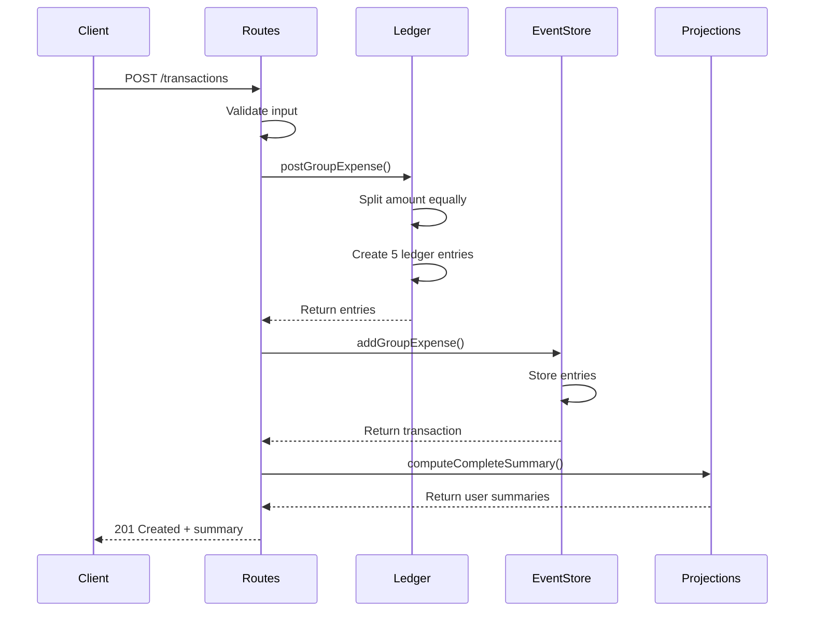
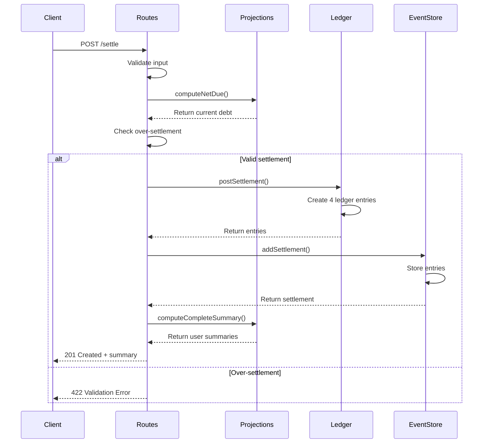
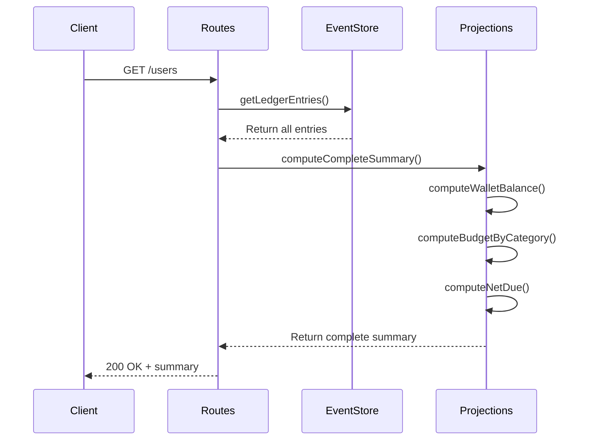

# Architecture Overview

This document describes the system architecture for the Split Budget Tracker, focusing on data flow, sequence diagrams, and key design decisions.

## System Overview

The Split Budget Tracker is a backend API that tracks shared expenses between two friends using double-entry ledger accounting. It maintains mathematical consistency between "spent vs paid vs owed" amounts while providing budget tracking by category.

## Core Components

### 1. Ledger System (`src/lib/ledger.ts`)

The heart of the system is a minimal double-entry ledger that maintains these account types:

- **CASH:{user}** - Wallet balance for each user
- **EXPENSE:{user}:{category}** - Budget tracking by category
- **DUE_FROM:A->B** - Amount A is owed by B
- **DUE_TO:B->A** - Amount B owes to A

### 2. Money Utilities (`src/lib/money.ts`)

Handles currency operations with integer-cent arithmetic:

- Banker's rounding to 2 decimal places
- Amount validation (positive, max 2 decimals)
- Equal splitting with remainder handling

### 3. Projections (`src/services/projections.ts`)

Pure functions that compute user summaries from ledger entries:

- Wallet balances
- Budget by category
- Net due calculations

### 4. Event Store (`src/repo/eventStore.ts`)

In-memory storage for ledger entries with transaction history.

### 5. HTTP Adapters (`src/adapters/http/`)

Express.js routes with validation, error handling, and idempotency support.

## Data Flow

### Group Expense Flow

When a user pays for a group expense, the system creates multiple ledger entries:

```
User A pays $120.00 for food:

1. CASH:A: -120.00 (A's wallet decreases)
2. EXPENSE:A:food: +60.00 (A's food budget increases)
3. EXPENSE:B:food: +60.00 (B's food budget increases)
4. DUE_FROM:A->B: +60.00 (B owes A $60)
5. DUE_TO:B->A: -60.00 (B's liability to A)
```

**Key Points**:

- Payer's cash decreases by full amount
- Both users' expense budgets increase by equal share
- Inter-user debt is created for the other user's share
- Transaction is always balanced (sum of deltas = 0)

### Settlement Flow

When users settle debts, only cash and inter-user balances change:

```
User B pays A $30.00:

1. CASH:B: -30.00 (B's wallet decreases)
2. CASH:A: +30.00 (A's wallet increases)
3. DUE_FROM:A->B: -30.00 (A's receivable decreases)
4. DUE_TO:B->A: +30.00 (B's liability decreases)
```

**Key Points**:

- Expense accounts are never affected by settlements
- Only cash and inter-user balances change
- Settlement reduces the debt between users

## Sequence Diagrams

### Group Expense Transaction



### Settlement Transaction



### User Summary Query



## Rounding Policy

The system uses integer-cent arithmetic to avoid floating-point drift. When splitting odd amounts:

- **$100.00 split**: $50.00 each (no remainder)
- **$101.00 split**: $50.50 each (no remainder)
- **$100.01 split**: Payer gets $50.01, other gets $50.00 (remainder goes to payer's expense)

**Key Rule**: Any remainder cent goes to the payer's expense budget, not the inter-user balances. This ensures the transaction always balances exactly and reflects that the payer actually spent the extra cent.

## Error Handling

All errors follow RFC 7807 Problem Details format:

```json
{
  "type": "validation-error",
  "title": "Invalid amount",
  "detail": "Amount must be positive and have at most 2 decimal places",
  "status": 422
}
```

Common error types:

- `validation-error` (422) - Invalid payload/amount/category
- `over-settlement` (400) - Paying more than owed
- `idempotency-conflict` (409) - Key exists with different body
- `not-found` (404) - Unknown routes

## Idempotency

POST endpoints support optional `Idempotency-Key` header for reliable retries:

- **New key**: Process normally, return 201 Created
- **Duplicate key + same body**: Return 200 OK with original response
- **Duplicate key + different body**: Return 409 Conflict

## Data Persistence

Currently uses in-memory storage for simplicity. The event store maintains:

- All ledger entries with timestamps
- Transaction history for audit trails
- User summaries computed on-demand

For production, this would need to be replaced with persistent storage (database, Redis) to survive server restarts.

## Performance Characteristics

- **Reads**: O(n) where n = number of ledger entries (linear scan)
- **Writes**: O(1) for new transactions (append-only)
- **Memory**: O(n) where n = total ledger entries

For two users with typical transaction volumes, performance is adequate. The system is designed for correctness over performance, prioritizing mathematical consistency and auditability.
